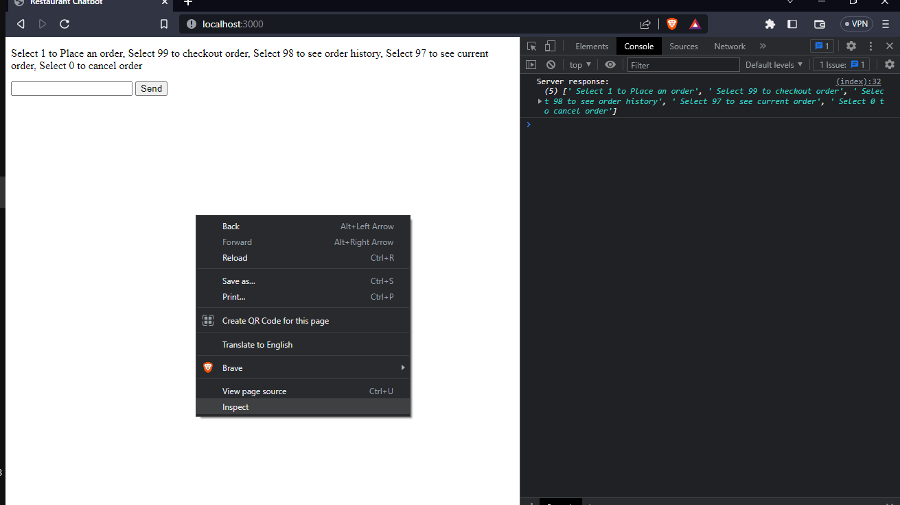

# RESTURANT CHATBOT
This a restaurant chatbot that is meant to assist customers in placing orders for their preferred meals

## FUNCTIONALITIES 
When a customer lands on the chatbot page, the bot should send these options to the customer:
Select 1 to Place an order
Select 99 to checkout order
Select 98 to see order history
Select 97 to see current order
Select 0 to cancel order
When a customer selects “1”, the bot returns a list of items from the restaurant. 
When a customer selects “99”, the bot responds with “order placed” and if none the bot responds with “No order to place”. 
When a customer selects “98”, the bot returns all placed order.
When a customer selects “97”, the bot returns the current order.
When a customer selects “0”, the bot cancels the order if there is.

## DEPLOYMENT 
You can find the live site [here](https://restaurantchatbot-production.up.railway.app/)

## INSTRUCTIONS 
Visit the live site and place your order with the textbox and form submit button.
The options will be displayed on the webpage. 
You can also open the webpage console to see server responses. You can do this by right-clicking anywhere on the page. Clicking on the inspect tab, then clicking on the console window. 

